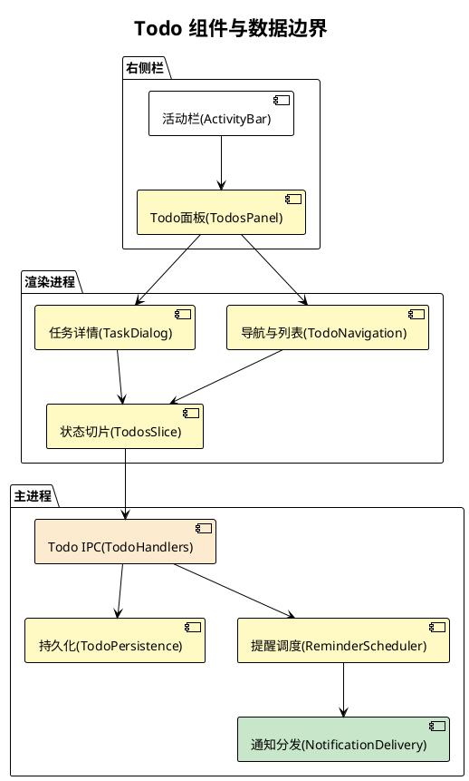
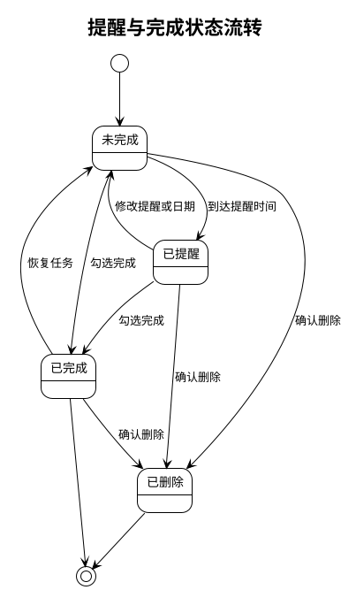
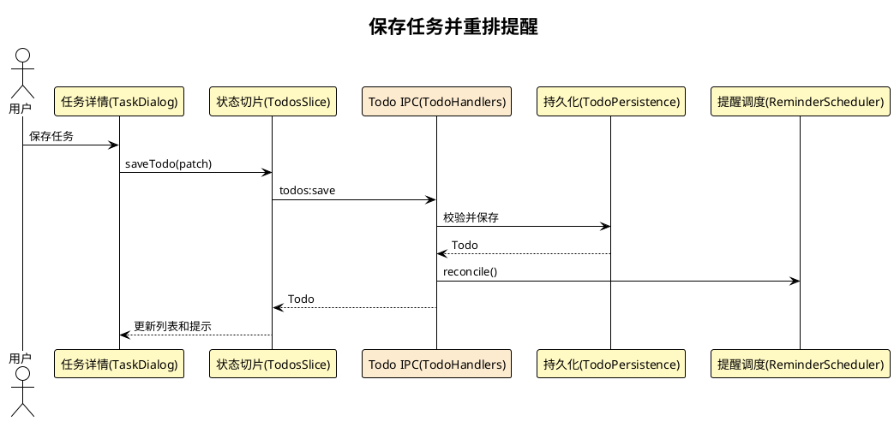

# 前端设计文档：Todo 功能

> 需求名称：Todo功能
> 日期：2026-09-10
> 状态：待评审
> 关联：.sdlc/01-prd/00-Todo功能.md
> 项目画像：web-frontend（Electron + React + TypeScript）｜启用章节：[frontend-compat]

---

## 〇、需求描述

将已上线的轻量 Todo 扩展为对齐 Microsoft To Do 核心体验的本地任务管理：全局/项目自定义列表、任务日期与单次提醒、我的一天、重要/计划内/全部/已完成视图、一级步骤及完成归档。仅本机持久化，不含同步和协作。

## 一、页面与路由

| 视图 | 位置 | 变更 | 说明 |
|---|---|---|---|
| Todo Tab | 右侧活动栏 | 复用 | 现有 `todos` Tab 已注册，无需改路由 |
| Todo 导航 | Todo 面板左侧区域 | 改造 | 显示智能视图与当前 scope 的自定义列表 |
| 任务列表 | Todo 面板主区域 | 改造 | 按当前列表或智能视图展示未完成任务 |
| 任务详情 | Dialog | 改造 | 编辑标题、备注、重要、日期、提醒、我的一天、步骤 |
| 已完成 | 智能视图 | 新增 | 展示归档任务并支持恢复 |

## 二、组件拆分

| 组件 | 职责 | 变更 | 复用 |
|---|---|---|---|
| `TodosPanel` | scope、当前视图/列表和加载状态 | 改造 | 保留 lazy 面板与项目切换加载 |
| `TodoNavigation` | 智能视图、列表选择与列表管理 | 新增 | 活动栏样式与 i18n |
| `TodoList` / `TodoItemRow` | 排序、日期/重要/步骤摘要、完成操作 | 改造 | 现有行项和删除二次确认 |
| `TodoTaskDialog` | 完整任务编辑及步骤维护 | 替换 | `components/ui/dialog.tsx`、`Button`、原生 date 输入 |
| `TodoQuickAdd` | 在当前列表快速新增标题任务 | 改造 | `TodoAddInput` |
| `TodosSlice` | 规范化缓存、查询、更新、跨窗口失效 | 改造 | 现有 Zustand load/error/乐观更新模式 |

UI 一律使用 `main.css` token、现有 `Dialog` 与 i18n `translate`；不新增颜色、阴影或自定义弹层。

## 三、状态管理

### 3.1 模型与兼容迁移

在 `src/shared/types.ts` 扩展 `Todo`，新增 `listId`、`important`、`dueDate`（`YYYY-MM-DD`）、`reminderAt`（UTC epoch ms）、`reminderDeliveredAt`、`myDayDate`（本地日期）、`steps`、`completedAt`。保留 `done` 作为完成/归档事实，避免破坏现有数据；`done=true` 的任务仅在已完成视图返回。

新增 `TodoList`：`id`、`repoId`、`title`、`createdAt`、`updatedAt`。`repoId=''` 表示全局，非空表示项目范围。持久化新增全局及按 repo 的列表记录。

旧 Todo 首次读取时归入每个 scope 的不可删除默认「任务」列表；旧字段缺失默认：不重要、无日期/提醒/我的一天、空步骤、未完成。迁移在主进程标准化入口完成并随下次保存落盘。

### 3.2 查询与排序

`TodosSlice` 维护当前 scope、当前导航项、列表/任务缓存及加载状态。默认只加载当前 scope，切换 worktree 后仅刷新项目 scope。智能视图由已加载任务派生：

- 我的一天：汇总全局和当前项目中 `myDayDate === 本地今天` 的未完成任务；项目任务展示所属项目来源。
- 重要：`important=true` 且未完成。
- 计划内：存在 `dueDate` 且未完成；逾期优先。
- 全部：未完成任务。
- 已完成：`done=true`。

排序固定为：逾期、今天到期、其余有截止日期、无日期；同组按 `updatedAt` 倒序。列表视图只展示所属列表的任务。

### 3.3 更新与跨窗口一致性

保留乐观更新及失败回滚；更新 payload 是完整可编辑字段的 patch，由主进程返回权威 Todo 覆盖本地项。订阅 `window.api.todos.onChanged/onGlobalChanged`：收到失效事件后强制刷新已加载 bucket，避免多窗口和后台提醒造成陈旧视图。`todoScope` 改为通过持久化状态读写，或删除旧的未使用字段；本方案选择持久化当前 scope。

### 3.4 完成、提醒与每日重置

完成、删除、日期/提醒修改时由主进程重算提醒；完成或删除会取消未触发提醒。调度器启动时从持久化数据恢复未完成且未触发的提醒，只持有最近提醒的一个 timer，触发后记录 `reminderDeliveredAt` 并调度下一项。我的一天按渲染时的本地日期计算，跨日自然不再命中，无需批量改写任务。

## 四、接口契约

保留既有 `todos:*` channel，并升级为 scope 通用的列表和任务操作；preload 仅暴露强类型对象。

| Channel | 用途 | 请求/响应关键字段 | 错误处理 |
|---|---|---|---|
| `todos:listLists` | 查询 scope 内列表 | `repoId` → `TodoList[]` | scope 无效拒绝 |
| `todos:saveList` | 新建/改名列表 | `repoId,id?,title` → `TodoList` | trim 后不能为空、≤500 |
| `todos:removeList` | 删除列表及任务 | `repoId,listId,confirmed` | 非默认列表且确认后执行 |
| `todos:list` | 查询 scope 内任务 | `repoId` → `Todo[]` | 兼容旧调用 |
| `todos:save` | 新建/编辑任务 | `repoId,id?,listId,title,note,important,dueDate,reminderAt,myDayDate,steps` → `Todo` | 校验归属、日期、长度和步骤 |
| `todos:toggle` | 完成/恢复任务 | `repoId,todoId,done` → `Todo` | 不存在则拒绝 |
| `todos:remove` | 删除任务 | `repoId,todoId` | 不存在视为失败 |
| `todos:changed` | scope 失效通知 | `repoId` | renderer 强制刷新 |

全局调用沿用 `repoId=''` 的同一契约，淘汰重复的 global 方法，但在一个发布周期保留旧 preload 方法作为适配层，避免混合版本运行时失败。

## 五、兼容性 `[frontend-compat]`

| 检查项 | 方案 |
|---|---|
| 目标端 | macOS、Linux、Windows Electron 桌面端 |
| 日期兼容 | 使用原生 `type=date`；持久化为 ISO 日期，不保存本地化展示值 |
| 旧数据 | 缺失新增字段按默认值；旧任务自动进入默认列表 |
| 通知权限 | 复用 Settings/Onboarding 现有权限状态与引导，不新增 Todo 专属授权流程 |
| 远程/SSH | Todo 数据与通知属于客户端本机，不依赖执行主机 |

## 六、埋点与监控 `[frontend-compat]`

MVP 记录本地错误日志和提醒调度失败；产品 telemetry 延后。至少覆盖：调度恢复数量、触发/跳过/失败次数、保存/迁移失败和通知权限拒绝原因，字段不得含任务标题或备注。

## 七、性能预算

| 指标 | 目标 | 手段 |
|---|---|---|
| 面板加载 | P99 < 100ms | 保持 lazy import 与 scope 懒加载 |
| 任务交互 | P99 < 100ms | 乐观更新、派生视图内存计算 |
| 提醒调度 | 常驻一个 timer | 只调度最近提醒，变更时重算 |
| 列表渲染 | 100 条内 < 50ms | 无虚拟列表；超出时再评估 |

## 八、灰度与回滚

| 检查项 | 方案 |
|---|---|
| 灰度 | 纯本地功能，随客户端版本发布 |
| 回滚 | 新字段保持可选；旧版本忽略未知字段，旧任务仍可读取 |
| 数据恢复 | 删除列表/任务是确认后的永久删除；不承诺回滚后恢复新增数据 |

## 九、引用梳理

| 类型 | 分析结果 |
|---|---|
| 现有 Todo 全链路 | `types.ts`、`persisted-state-types.ts`、`todo-persistence.ts`、`todo-handlers.ts`、preload bridge、`todos.ts` slice 与右侧栏组件 |
| 复用 UI | `components/ui/dialog.tsx`、`Button`、`Input`、原生日期输入模式、i18n `translate` |
| 通知 | `notifications.ts`、`notification-options.ts`、`native-notification-delivery.ts` 与既有权限状态 UI |
| 必须补齐的清理 | `repo-lifecycle-operations.ts` 的项目删除与孤儿 repo 清扫需同步删除项目 Todo/列表 |
| 测试 | 现有 slice、repo-pruning、E2E；新增迁移、IPC、调度、通知、智能视图及 UI/E2E 覆盖 |

## 十、风险与权衡

| # | 类型 | 描述 | 应对 |
|---|---|---|---|
| 1 | 风险 | 旧数据没有列表归属 | 标准化时创建默认列表并映射旧任务 |
| 2 | 风险 | 重启或编辑可能重复提醒 | 使用 `reminderDeliveredAt` 和主进程单调度器 |
| 3 | 风险 | 多窗口缓存陈旧 | 消费现有变更事件并强制刷新已加载 scope |
| 4 | 风险 | 项目删除遗留数据 | 持久化层生命周期与 renderer pruning 同时清理 |
| 5 | 权衡 | 完成任务改为归档而非行内展示 | 对齐新 PRD；已完成视图提供恢复入口 |
| 6 | 权衡 | 本期不做云同步/协作 | 保持本地数据边界和可控复杂度 |

## 十一、验收标准回链

| # | 验收标准 | 设计机制 | 覆盖 |
|---|---|---|---|
| 1 | Todo Tab 可访问 | §一复用既有 Tab 注册 | 完全 |
| 2-3 | 全局/项目列表及安全删除 | §三模型、§四列表契约 | 完全 |
| 4-5 | 任务与一级步骤 | §二组件、§三模型、§四保存契约 | 完全 |
| 6 | 完成归档与恢复 | §三状态流转、智能视图 | 完全 |
| 7-8 | 我的一天与智能视图 | §三派生查询规则 | 完全 |
| 9-10 | 单次提醒和逾期展示 | §三调度、§四保存契约 | 完全 |
| 11-13 | 隔离、持久化与多窗口 | §三失效同步、§五兼容性、§九清理 | 完全 |
